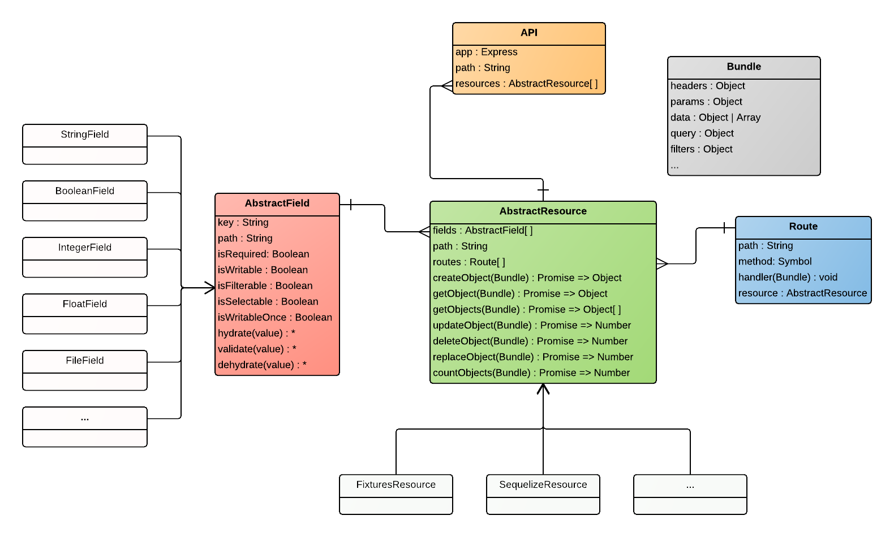

# Restypie
Tastypie inspired, lightweight and storage agnostic REST resources manager.

## Requirements
This module requires Node@4.x.x or upper.

## Installation
`npm install restypie --save`

## Components

Below a simplified schema representing how the main components are linked to each other :



**Restypie** relies on 5 main components :
- An **`API`** : to be seen as a set of resources, the api will automatically register the resources routes on your express
app when calling `launch()`
- One or more **`AbstractResource`s** : to be seen as the connector to your data storage, the resource is capable of
parsing, formatting, reading, writing, deleting the incoming and outgoing data
  - One or more **`AbstractField`s** : fields describe the data you want to expose on your resource, those can be of
  any type and either be read only, protected, private...
  - One or more **`Route`s** : simple association between a `path` and a `handler`, the route will ask the resource to
  do what it needs with the incoming request and decide what has to be sent back (body, headers, ...)
- **`Bundle`** : the bundle is a _container_ that passes through and is fulfilled by all resource handlers that the
route calls

## Basic example

To be original, let's say we want to create an amazing app handling the registration of users.

#####1) Let's create a basic express app :
```javascript
/* app.js */

let express = require('express');
let bodyParser = require('body-parser');
let http = require('http');
let Restypie = require('restypie');

const PORT = 8888;

let app = express();
app.use(bodyParser.json());

http.createServer(app).listen(PORT, function () {
  console.log('Restypie example listening on port ' + PORT);
});
```

#####2) Let's create a resource :

```javascript
/* app.js */

/* ... code removed for clarity ... */

const PORT = 8888;

class UsersResource extends Restypie.Resources.FixturesResource {
  get path() { return 'users'; }
  get routes() {
    return [
      Restypie.BasicRoutes.PostRoute,
      Restypie.BasicRoutes.GetSingleRoute,
      Restypie.BasicRoutes.GetManyRoute,
      Restypie.BasicRoutes.PatchSingleRoute
    ];
  }

  get schema() {
    return {
      // Your schema needs to have a primary key to be valid
      id: { type: 'int', isPrimaryKey: true, isReadable: true },
      firstName: { type: String, isReadable: true, isWritable: true },
      lastName: { type: String, isReadable: true, isWritable: true },
      // The pattern will validate the email - the email is mandatory
      email: { type: String, pattern: /^[A-Z0-9._-]+@[A-Z0-9.-]+\.[A-Z0-9.-]+$/i, isRequired: true, isReadable: true },
      dateOfBirth: { type: Date, isReadable: true, isWritable: true },
      // The image can be 1MB large at maximum
      profilePicture: { type: 'file', maxSize: 1000000, isReadable: true, isWritable: true },
      // Validate the password length - `isWritableOnce` prevents it to be updated once written and makes required/writable
      password: { type: String, minLength: 6, maxLength: 20, isWritableOnce: true }
    };
  }

});

/* ... code removed for clarity ... */
```

#####3) And a v1 api :

```javascript
/* app.js */

/* ... code removed for clarity ... */

let v1 = new Restypie.API({ path: 'v1', resources: { Users: UsersResource } });

/* ... code removed for clarity ... */
```

#####4) Now let's launch the api :

```javascript
/* app.js */

/* ... code removed for clarity ... */

v1.launch(app);

http.createServer(app).listen(PORT, function () {
  console.log('Restypie example listening on port ' + PORT);
});
```

#####That's it ! You can now create new users :
```
// POST /v1/users
// Content-Type: application/json
{
  email: 'john.doe@example.com',
  password: 'Passw0rd'
}
```

Even upload a profile picture :
```
// POST /v1/users
// Content-Type: multipart/form-data
{
  email: 'jane.doe@example.com',
  password: 'Passw0rd',
  profilePicture: /* a file */
}
```

#####You can retrieve those users :
```
// GET /v1/users
{
  meta: {
    total: 2,
    limit: 20,
    offset: 0,
    next: null,
    prev: null
  },
  data: [{ // Passwords are not shown because they are not in the `selectableFields` list of the resource
    id: 1,
    email: 'john.doe@example.com'
  }, {
    id: 2,
    email: 'jane.doe@example.com',
    profilePicture: 'path/to/tmp/dir/foo.png'
  }]
}
```

#####Retrieve a user by id :
```
// GET /v1/users/1
{
  data: {
    id: 1,
    email: 'john.doe@example.com'
  }
}
```

#####Update a user :
```
// PATCH /v1/users/2
{
  firstName: 'Jane',
  lastName: 'Doe'
}

// GET /v1/users/2
{
  data: {
    id: 2,
    email: 'jane.doe@example.com',
    profilePicture: 'path/to/tmp/dir/foo.png',
    firstName: 'Jane',
    lastName: 'Doe'
  }
}

```


## TODO
- Support relations
- Support of projection
- Support of sorting
- Hooks
